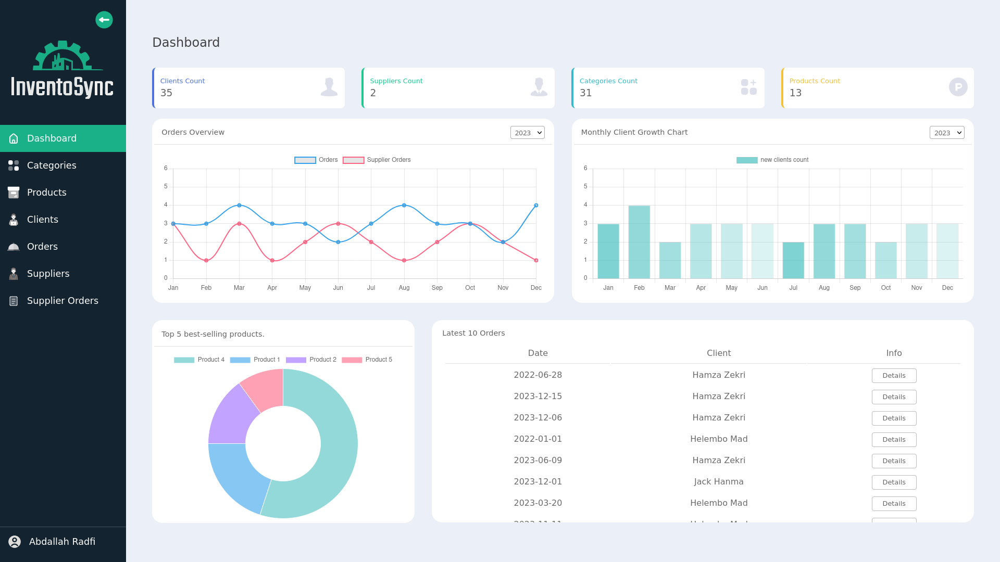

# InventoSync - Stock Management Web App

InventoSync is a web application designed for stock management. It enables users to efficiently manage products, clients, suppliers, orders, and provides insightful statistics on a comprehensive dashboard.

## Technologies Used

- HTML
- CSS
- JavaScript
- Chart.js
- PHP
- MySQL

## Project Structure

The project follows the Model-View-Controller (MVC) architecture pattern for better organization and maintainability.

### Functionalities

1. **Dashboard:**
   - Display statistics such as client count, monthly client growth, etc.

2. **Product Management:**
   - Manage products effectively.

3. **Product Categories:**
   - Categorize and manage product categories.

4. **Client Management:**
   - Maintain client information efficiently.

5. **Supplier Management:**
   - Manage information related to suppliers.

6. **Client Orders:**
   - Handle client orders seamlessly.

7. **Supplier Orders:**
   - Manage orders from suppliers.

8. **Settings:**
   - Personalize your information, including name, email, and password.

### Database

- The `db.sql` file in the root of the project contains the necessary SQL statements to set up the database.

## Getting Started

1. Clone the repository: `git clone https://github.com/AbdallahRdf/stock-management.git`
2. Import the database using `db.sql`.
3. Configure database connection in the appropriate files.
4. Deploy the application using a web server.

## Contributing

Feel free to contribute to the project by following these steps:

1. Fork the repository.
2. Create a new branch: `git checkout -b feature/new-feature`
3. Make your changes and commit them: `git commit -m 'Add new feature'`
4. Push to the branch: `git push origin feature/new-feature`
5. Submit a pull request.

## License

This project is licensed under the [MIT License](LICENSE).
